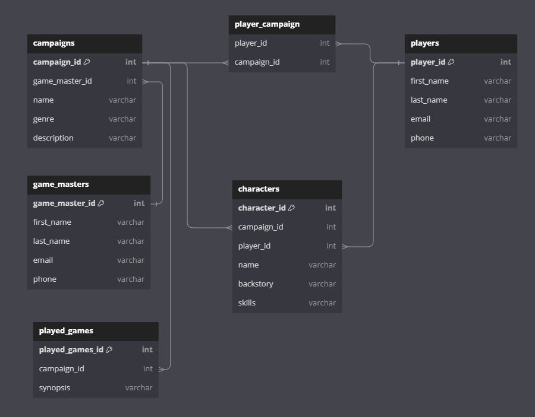

# Welcome to my Campaign Manager API
GitHub: https://github.com/BenGormanCode/Campaign-Manager-API

Database Host: 

API Host: 

# Overview
This is a Campaign Manager for Tabletop Roleplay Games. This tool is designed to hold all the information a gaming group should need in regards to their campaigns including the game master, the campaign, the games played, the characters and the players. Storing all of this information would be useful for keeping track of all the games the user has played or for a venue that is holding multiple of these games at once. 

This application has basic CRUD functionality. You can create, read, update or delete any of the given entities. This allows for a complete control of the user experience. The only fields that are compulsory (non-nullable) within the application are for names and id's which is to guarantee that the user can easily identify the data they have entered into the application. 

# Planning Stage

## What I Chose and Why
For this application, I decided to use Python, with Flask as the WSGI. Python is a high level language that is known for being beginner friendly, which is perfect for where I am currently in my coding journey. Python being known for it's role in data science and processing made it an obvious choice. Compared to an alternatives such as JSNode or Express, it seemed that Flask was far more flexible on the scale which my project requires, as opposed to others which are more inclined towards scalability, real time interactions and simultaneous database requests. With Flask, I elected to use postgreSQL. I find relational databases to ne easier to work with and understand. While a NoSQL database such as MongoDB could have worked for this project, I elected to go with the method I have invested the most time in learning. 

## Imports and Libraries
### Flask
Flask is a web framework for building and managing web application. It is used in this project for blueprints, requests, json support and as a framework for the other libraries to build on top of. 
If you want to know more, you can read it here: https://flask.palletsprojects.com/en/stable/

### SqlAlchemy
Used as an SQL toolkit and ORM. Used in this project for schema's, query's and python relationships. 
If you want to know more, you can read it here: https://www.sqlalchemy.org/

### Marshmallow
Additional tools for Flask and SQL Alchemy. Used in this project to expand SQLAlchemy's functionality including serialisation. 
If you want to know more, you can read it here: https://flask-marshmallow.readthedocs.io/en/latest/

### psycopg2
Psycopg2 enables Python applications to connect to, interact with, and perform operations on PostgreSQL databases. Was used in this project for PostgreSQL operations. 
If you want to know more, you can read it here: https://pypi.org/project/psycopg2/

### pep8
Pep8 simply converts the code to follow pep8 guidelines
If you want to know more, you can read it here: https://pypi.org/project/pep8/

### gunicorn
Gunicorn is a python HTTP server for UNIX. It was used in the process of hosting the database and API. 
If you want to know more, you can read it here: https://gunicorn.org/

# Feedback
## Feedback 1

## Feedback 2

## Implementation of Feedback

# Set Up 
Users will be able access the database from the hosting link provided at the top of this read me. 

If you wish to operate it through your own terminal, you can follow these steps: 

## Terminal Set Up
1. Click the Green Code Button at the top right of the repository
2. Copy the SSH key
3. Open the terminal
4. Change the current working directory to the location where you want the cloned directory: cd /path/to/your/desired/folder
5. Type git clone and then enter the SSH from the previous steps. Press Enter. 

## Dependencies
This application has a number of dependencices which should be used in a virtual environment. To set these up, 
1. Set up the environment: python3 -m venv.venv
2. Activate the environment: source .venv/bin/activate
3. Add the .venv file to a .gitignore
4. Install dependencies: pip install -r requirements.txt

# What This Application Can Do
This application has 5 entities
- Game Master
- Character
- Player
- Campaign
- Played Games

The functions below can apply to any of these entities. 

## Create
This allows the user to add data to the database. This does this by ...

## Read Select
This allows the user to select data in the database to read. To do so, the function creates a route (using dynamic routing), constructs a query to find the object, and filters by the given id. If it is found, it returns the data in a json format, and if not, provides a 404 error. 

## Read All 
This allows the user to select an entity within the database and read all of it's contents. To do this, a route is defined within Flask that retrieves a list from the database. It first constructs a query using the SQLAlchemy library to select all the current entries within the Campaign model, fetches the resulting rows, returns them as a list of objects, and then lists them in a suitable format (JSON).

## Update 
This allows the user to update an pre-existing entity within the database. This does this by...

## Delete 
This allows the user to search for a specific entity within the database and delete it. This does this by 

# Licenses
The licenses for this application and all of it's packages can be found below. All of these licenses allow unrestricted use of their functionality provided that the licenses are included and the name of the copyright holder is not used to endorse these products. 

This application is covered under the MIT license.

Marshmallow, SQLAlchemy, gunicorn and pep8 are all covered under the MIT License. 

Flask is covered under the BSD-3-Clause License. 

Psycopg2 is covered under the GNU Lesser General Public License. 

## MIT License
Permission is hereby granted, free of charge, to any person obtaining a copy of this software and associated documentation files (the “Software”), to deal in the Software without restriction, including without limitation the rights to use, copy, modify, merge, publish, distribute, sublicense, and/or sell copies of the Software, and to permit persons to whom the Software is furnished to do so, subject to the following conditions:

The above copyright notice and this permission notice shall be included in all copies or substantial portions of the Software.

THE SOFTWARE IS PROVIDED “AS IS”, WITHOUT WARRANTY OF ANY KIND, EXPRESS OR IMPLIED, INCLUDING BUT NOT LIMITED TO THE WARRANTIES OF MERCHANTABILITY, FITNESS FOR A PARTICULAR PURPOSE AND NONINFRINGEMENT. IN NO EVENT SHALL THE AUTHORS OR COPYRIGHT HOLDERS BE LIABLE FOR ANY CLAIM, DAMAGES OR OTHER LIABILITY, WHETHER IN AN ACTION OF CONTRACT, TORT OR OTHERWISE, ARISING FROM, OUT OF OR IN CONNECTION WITH THE SOFTWARE OR THE USE OR OTHER DEALINGS IN THE SOFTWARE.

## BSD-3-Clause License
Copyright 2010 Pallets

Redistribution and use in source and binary forms, with or without
modification, are permitted provided that the following conditions are
met:

1.  Redistributions of source code must retain the above copyright
    notice, this list of conditions and the following disclaimer.

2.  Redistributions in binary form must reproduce the above copyright
    notice, this list of conditions and the following disclaimer in the
    documentation and/or other materials provided with the distribution.

3.  Neither the name of the copyright holder nor the names of its
    contributors may be used to endorse or promote products derived from
    this software without specific prior written permission.

THIS SOFTWARE IS PROVIDED BY THE COPYRIGHT HOLDERS AND CONTRIBUTORS
"AS IS" AND ANY EXPRESS OR IMPLIED WARRANTIES, INCLUDING, BUT NOT
LIMITED TO, THE IMPLIED WARRANTIES OF MERCHANTABILITY AND FITNESS FOR A
PARTICULAR PURPOSE ARE DISCLAIMED. IN NO EVENT SHALL THE COPYRIGHT
HOLDER OR CONTRIBUTORS BE LIABLE FOR ANY DIRECT, INDIRECT, INCIDENTAL,
SPECIAL, EXEMPLARY, OR CONSEQUENTIAL DAMAGES (INCLUDING, BUT NOT LIMITED
TO, PROCUREMENT OF SUBSTITUTE GOODS OR SERVICES; LOSS OF USE, DATA, OR
PROFITS; OR BUSINESS INTERRUPTION) HOWEVER CAUSED AND ON ANY THEORY OF
LIABILITY, WHETHER IN CONTRACT, STRICT LIABILITY, OR TORT (INCLUDING
NEGLIGENCE OR OTHERWISE) ARISING IN ANY WAY OUT OF THE USE OF THIS
SOFTWARE, EVEN IF ADVISED OF THE POSSIBILITY OF SUCH DAMAGE.

## GNU Lesser General Public License
GNU LESSER GENERAL PUBLIC LICENSE
Version 3, 29 June 2007

Copyright © 2007 Free Software Foundation, Inc. <https://fsf.org/>

Everyone is permitted to copy and distribute verbatim copies of this license document, but changing it is not allowed.

This version of the GNU Lesser General Public License incorporates the terms and conditions of version 3 of the GNU General Public License, supplemented by the additional permissions listed below.

0. Additional Definitions.
As used herein, “this License” refers to version 3 of the GNU Lesser General Public License, and the “GNU GPL” refers to version 3 of the GNU General Public License.

“The Library” refers to a covered work governed by this License, other than an Application or a Combined Work as defined below.

An “Application” is any work that makes use of an interface provided by the Library, but which is not otherwise based on the Library. Defining a subclass of a class defined by the Library is deemed a mode of using an interface provided by the Library.

A “Combined Work” is a work produced by combining or linking an Application with the Library. The particular version of the Library with which the Combined Work was made is also called the “Linked Version”.

The “Minimal Corresponding Source” for a Combined Work means the Corresponding Source for the Combined Work, excluding any source code for portions of the Combined Work that, considered in isolation, are based on the Application, and not on the Linked Version.

The “Corresponding Application Code” for a Combined Work means the object code and/or source code for the Application, including any data and utility programs needed for reproducing the Combined Work from the Application, but excluding the System Libraries of the Combined Work.

1. Exception to Section 3 of the GNU GPL.
You may convey a covered work under sections 3 and 4 of this License without being bound by section 3 of the GNU GPL.

2. Conveying Modified Versions.
If you modify a copy of the Library, and, in your modifications, a facility refers to a function or data to be supplied by an Application that uses the facility (other than as an argument passed when the facility is invoked), then you may convey a copy of the modified version:

a) under this License, provided that you make a good faith effort to ensure that, in the event an Application does not supply the function or data, the facility still operates, and performs whatever part of its purpose remains meaningful, or
b) under the GNU GPL, with none of the additional permissions of this License applicable to that copy.
3. Object Code Incorporating Material from Library Header Files.
The object code form of an Application may incorporate material from a header file that is part of the Library. You may convey such object code under terms of your choice, provided that, if the incorporated material is not limited to numerical parameters, data structure layouts and accessors, or small macros, inline functions and templates (ten or fewer lines in length), you do both of the following:

a) Give prominent notice with each copy of the object code that the Library is used in it and that the Library and its use are covered by this License.
b) Accompany the object code with a copy of the GNU GPL and this license document.
4. Combined Works.
You may convey a Combined Work under terms of your choice that, taken together, effectively do not restrict modification of the portions of the Library contained in the Combined Work and reverse engineering for debugging such modifications, if you also do each of the following:

a) Give prominent notice with each copy of the Combined Work that the Library is used in it and that the Library and its use are covered by this License.
b) Accompany the Combined Work with a copy of the GNU GPL and this license document.
c) For a Combined Work that displays copyright notices during execution, include the copyright notice for the Library among these notices, as well as a reference directing the user to the copies of the GNU GPL and this license document.
d) Do one of the following:
0) Convey the Minimal Corresponding Source under the terms of this License, and the Corresponding Application Code in a form suitable for, and under terms that permit, the user to recombine or relink the Application with a modified version of the Linked Version to produce a modified Combined Work, in the manner specified by section 6 of the GNU GPL for conveying Corresponding Source.
1) Use a suitable shared library mechanism for linking with the Library. A suitable mechanism is one that (a) uses at run time a copy of the Library already present on the user's computer system, and (b) will operate properly with a modified version of the Library that is interface-compatible with the Linked Version.
e) Provide Installation Information, but only if you would otherwise be required to provide such information under section 6 of the GNU GPL, and only to the extent that such information is necessary to install and execute a modified version of the Combined Work produced by recombining or relinking the Application with a modified version of the Linked Version. (If you use option 4d0, the Installation Information must accompany the Minimal Corresponding Source and Corresponding Application Code. If you use option 4d1, you must provide the Installation Information in the manner specified by section 6 of the GNU GPL for conveying Corresponding Source.)
5. Combined Libraries.
You may place library facilities that are a work based on the Library side by side in a single library together with other library facilities that are not Applications and are not covered by this License, and convey such a combined library under terms of your choice, if you do both of the following:

a) Accompany the combined library with a copy of the same work based on the Library, uncombined with any other library facilities, conveyed under the terms of this License.
b) Give prominent notice with the combined library that part of it is a work based on the Library, and explaining where to find the accompanying uncombined form of the same work.
6. Revised Versions of the GNU Lesser General Public License.
The Free Software Foundation may publish revised and/or new versions of the GNU Lesser General Public License from time to time. Such new versions will be similar in spirit to the present version, but may differ in detail to address new problems or concerns.

Each version is given a distinguishing version number. If the Library as you received it specifies that a certain numbered version of the GNU Lesser General Public License “or any later version” applies to it, you have the option of following the terms and conditions either of that published version or of any later version published by the Free Software Foundation. If the Library as you received it does not specify a version number of the GNU Lesser General Public License, you may choose any version of the GNU Lesser General Public License ever published by the Free Software Foundation.

If the Library as you received it specifies that a proxy can decide whether future versions of the GNU Lesser General Public License shall apply, that proxy's public statement of acceptance of any version is permanent authorization for you to choose that version for the Library.
